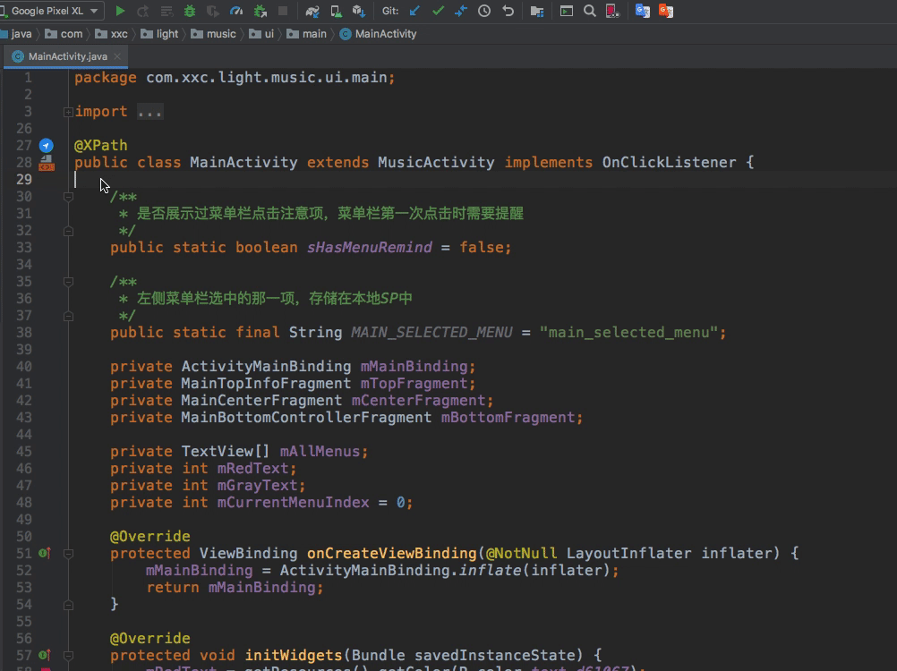

### XRouter-Navigation
##### 安装
1.  打开AS -> plugins -> marketplace 搜索XRouter-Navigation，点击安装即可
2.  直接下载最新的zip包(位于zip目录下)，将zip包拖入AS即可

##### 说明
1. 对于XRouter路由框架的辅助插件，主要用于进行Activity与调用处的来回跳转，
由于XRouter框架对Activity没有强关联性，只在每个Router类中声明了activity的全路径，
所以在开发过程中，无法做到随点随跳，影响搬砖体验，所以开发AS级的插件，在不侵入代码的情况下，
增强调用处与Activity的关联。
2. 从调用处跳转到对应Activity，使用:  
<video id="video" controls="" preload="none">
      <source id="mp4" src="https://youtu.be/8WPIngWW7zw" type="video/mp4">
</video>
3. 从Activity索引调用处，使用：

